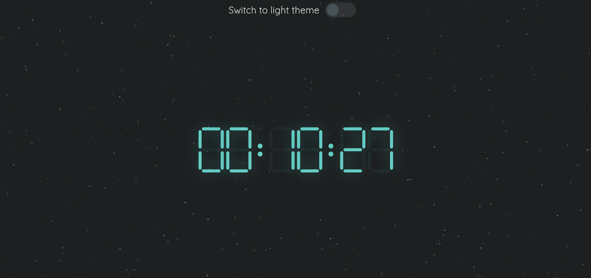

# Clock App


[App Link](https://clock-app.github.io/)
## Tech:
* JavaScript,
* HTML,
* CSS, 
* Particles.js

## Decisions made:
* Digital clock: in the modern world for most of the people analog clock doesn't really make sense. People have very fast rhythm of life. Digital clock helps identify time very quick.
* Dark and light theme: I would like to give users ability to use more comfortable colors for their screens.
* Use particles.js: for some people who have time, I decided to add a relaxing background. Particles.js is a lightweight library that helps to create very nice animated particles.

## New things tried:
1. Create dark & light themes: it was my first time creating 2 themes in one application. A few additional lines of code increases user experience.
```js
function handleThemeChange() {
  if (checkInput.checked === true) {
    document.body.className = 'light';
    textElement.className = 'dark-text';
    textElement.textContent = 'Switch to dark theme';
  } else {
    document.body.className = 'dark';
    textElement.className = 'light-text';
    textElement.textContent = 'Switch to light theme';
  };
};
```
2. CSS transform property: instead of manually changing size of digits for mobile version I discovered CSS transform property. It helps to make element smaller or bigger and keep the proportions of the element.
```css
transform: scale(0.8);
```

## Next improvements: 
* Allow user to switch between 24h and 12h time format.

## You can run locally
This project is not using any ports.
* Clone repo
* Copy path of an `index.html`file and paste in browser.

or

* Click 'Open in default browser '
